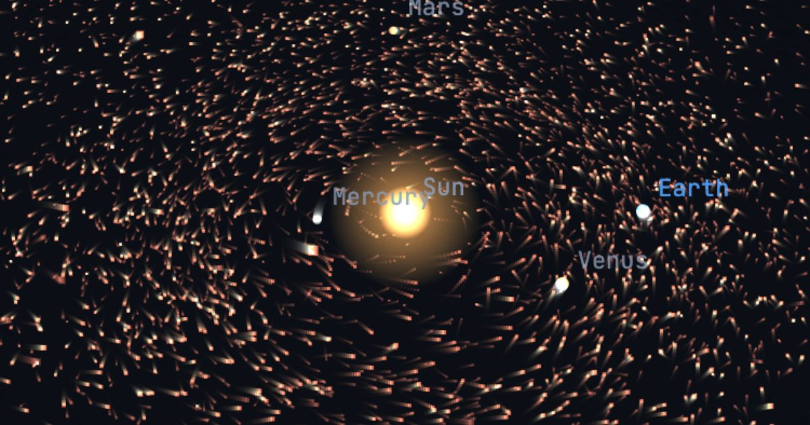

<div align="center">

<a href="https://kncn23.github.io/neo-swarm/"></a>

[](https://kncn23.github.io/neo-swarm/)

[](LICENSE)
[](https://kncn23.github.io)

**[Enter the swarm →](https://kncn23.github.io/neo-swarm/)**

<a href="https://kncn23.github.io/neo-swarm/"></a>

</div>

There are **42,025 known near-Earth asteroids**. This project shows them as they actually move:
**6,834 real orbits** — every potentially hazardous asteroid (all 2,540 PHAs) plus the brightest of
the rest — propagated from NASA/JPL's Small-Body Database and rendered as a living swarm around
the inner planets, in front of **41,411 real stars**. No frameworks, no WebGL, no API keys —
three stacked 2D canvases and Kepler's equation at 60 fps.

## ✨ Features

- ☄️ **The swarm** — 6,834 NEOs with real orbital elements from [JPL SBDB](https://ssd.jpl.nasa.gov/tools/sbdb_query.html); motion-blur trails make the orbital flow visible; filter to PHAs only
- 🔭 **Discovery timeline** — switch to *discovery* view and start in 1980: asteroids flash teal the moment they were actually found, and the swarm grows from a handful of rocks to thousands — eight decades of planetary defense in a minute
- 🌍 **Close approaches** — all **1,054 known passes within 0.05 au through 2033** from [JPL CNEOS](https://cneos.jpl.nasa.gov/ca/); click one and *watch it happen*: the clock jumps to 12 days before the pass, the camera locks onto Earth
- ⚠️ **Impact monitoring** — objects on [JPL Sentry](https://cneos.jpl.nasa.gov/sentry/) carry a risk badge with cumulative impact probability, Palermo/Torino scales and possible impact years
- ⭐ **The real sky** — the full BSC5/HYG catalog to magnitude 8.5 (41,411 stars) with 99 proper names, plus all 88 constellations drawn as stick figures — Sirius is where Sirius belongs
- 🌙 **Sense of scale** — lunar-distance rings (1 / 5 / 20 LD) around Earth and the actual Moon on its orbit, so a "close" approach means something
- 🔎 **Search** — find any of the 6,834 rocks by name or designation (try *Apophis*, *Bennu*, *Eros*); one button jumps straight to the famous **April 13, 2029 Apophis flyby**
- 📡 **Live ticker** — which plotted object is closest to Earth *right now*, in lunar distances, every frame
- 🎬 **Guided tour** — six narrated stops, from the full swarm to the 2029 Apophis flyby to the discovery timeline; sit back or skip ahead
- 🎨 **Two color modes** — *danger* (PHAs glow) or *type*: Apollo / Aten / Amor / Atira orbit classes, each in its own color with a legend
- 💥 **Impact energy** — every card carries a back-of-envelope kinetic-energy estimate (rocky density + encounter velocity), in megatons and × Hiroshima
- 🎥 **3D orbit camera** — drag to orbit, scroll/pinch to zoom, focus on the Sun or Earth; depth-scaled points for real parallax; keyboard: `space` `←→` `r` `t` `e` `esc`
- 📷 **One-click PNG export** of the current view
- 🔗 **Shareable views** — date, selection and mode live in the URL hash
- 🌐 **Bilingual** — EN/TR, auto-detected, persisted

## 🔬 How it works

Each asteroid's six elements *(a, e, i, Ω, ω, M₀)* come from SBDB at a reference epoch. For any
simulation date the mean anomaly advances by the mean motion *n = k/a^1.5* (Gaussian gravitational
constant), Kepler's equation `M = E − e·sin E` is solved with Newton's method, and the perifocal
position is rotated into J2000 ecliptic coordinates. The rotation matrix per asteroid is
precomputed once at load, so each frame costs one Kepler solve and six multiplications per body —
6,834 asteroids run comfortably at 60 fps without WebGL.

Stars are unit vectors rotated from equatorial (RA/Dec) into the same ecliptic frame and projected
through the identical camera — so the swarm and the sky rotate together, like they should.

## 📚 Data

| Data | Source | Snapshot |
|---|---|---|
| NEO orbital elements (42,025 objects) | [JPL Small-Body Database Query API](https://ssd-api.jpl.nasa.gov/doc/sbdb_query.html) | `assets/data/neos.json` |
| Close approaches ≤ 0.05 au → 2033 | [JPL CNEOS Close-Approach API](https://ssd-api.jpl.nasa.gov/doc/cad.html) | `assets/data/cad.json` |
| Impact risk (2,154 objects) | [JPL Sentry API](https://ssd-api.jpl.nasa.gov/doc/sentry.html) | `assets/data/extras.json` |
| Star catalog, mag ≤ 8.5 | [d3-celestial](https://github.com/ofrohn/d3-celestial) (BSC5 / HYG derived) | `assets/data/stars.json` |
| Constellation figures (88) | [d3-celestial](https://github.com/ofrohn/d3-celestial) | `assets/data/extras.json` |
| Planet orbits + Moon | [JPL approximate planetary positions](https://ssd.jpl.nasa.gov/planets/approx_pos.html) | inline |

The snapshot is reproducible — refresh it any time:

```bash
python3 tools/fetch_data.py
```

## 🗂️ Structure

```
.
├── index.html             # layout — canvases, header, panels, controls
├── assets/
│   ├── app.js             # Kepler propagation, 3D camera, rendering, interaction
│   ├── style.css          # design tokens + all styles
│   └── data/              # NASA/JPL + star catalog snapshots (JSON)
└── tools/
    └── fetch_data.py      # rebuilds the data snapshot from the APIs
```

## 🚀 Running locally

```bash
git clone https://github.com/KNCn23/neo-swarm.git
cd neo-swarm
python3 -m http.server 8000   # → http://localhost:8000
```

---

<div align="center">

🪐 Sister project: [**solar-system**](https://github.com/KNCn23/solar-system) — the planets, same physics

🌐 [**kncn23.github.io**](https://kncn23.github.io) · [**GitHub**](https://github.com/KNCn23)

<sub>Asteroids move per NASA/JPL — everything else is plain HTML, CSS and JS.</sub>

</div>
